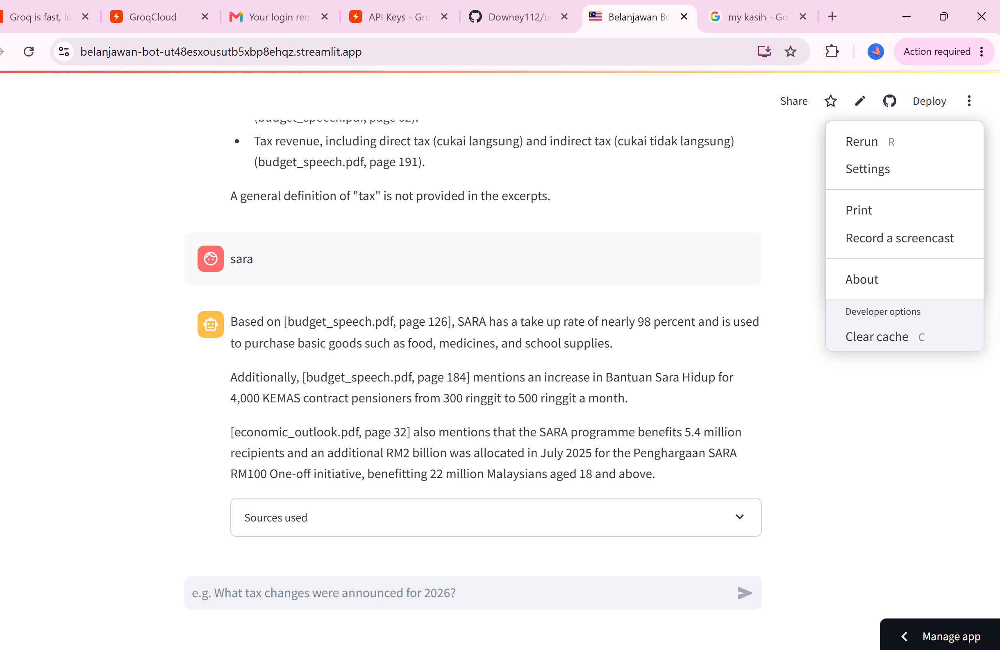

# Belanjawan Bot

**Live demo:** [belanjawan-bot-ut48esxousutb5xbp8ehqz.streamlit.app](https://belanjawan-bot-ut48esxousutb5xbp8ehqz.streamlit.app/)



A RAG (Retrieval-Augmented Generation) system that answers questions about
Malaysia's Budget 2026 (Belanjawan 2026), grounded in the actual official
documents from the Ministry of Finance — with page-level citations, not
hallucinated answers.

## Example interaction

**Q: What is SARA and who benefits from it?**

> Based on [budget_speech.pdf, page 126], SARA has a take up rate of nearly 98
> percent and is used to purchase basic goods such as food, medicines, and
> school supplies. Additionally, [budget_speech.pdf, page 184] mentions an
> increase in Bantuan Sara Hidup for 4,000 KEMAS contract pensioners from 300
> ringgit to 500 ringgit a month. [economic_outlook.pdf, page 32] also mentions
> that the SARA programme benefits 5.4 million recipients and an additional RM2
> billion was allocated in July 2025 for the Penghargaan SARA RM100 One-off
> initiative, benefitting 22 million Malaysians aged 18 and above.

Every claim traces back to a specific document and page — that's the actual
point of RAG over a plain chatbot: verifiable answers, not confident-sounding
guesses.

## Why this project

Basic sentiment analysis and Titanic-survival notebooks are considered
saturated in 2026 hiring — recruiters skim past them. RAG/LLM systems are
consistently flagged as the area most AI hiring is currently focused on,
and this version stays grounded in a real, current, Malaysia-specific
dataset rather than a generic tutorial corpus.

## Architecture

```
Budget 2026 PDFs (official Ministry of Finance documents)
        ↓
pdfplumber (text extraction, page-by-page for citation tracking)
        ↓
sentence-transformers (local embeddings — free, no API calls)
        ↓
Chroma (local vector database — no signup, no cloud service)
        ↓
top-k retrieval on user's question
        ↓
Groq API (Llama 3.3 70B — free tier, no credit card) generates the answer
        ↓
Streamlit chat UI
        ↓
Streamlit Community Cloud (free, GitHub-linked deploy)
```

Only **one** external signup is needed for this whole project (Groq) — a
deliberate choice after the multi-service juggling (Supabase/Render/Vercel)
on a previous project ate a lot of time on account setup and environment
variables. Everything else here runs locally with no API key required.

## Before you start

- Python 3.11+
- A free Groq account: [console.groq.com](https://console.groq.com) — sign
  up with email or Google, no credit card. Generate an API key from
  **API Keys** in the console.

## Day 1 — Get the real data and build the index

```bash
pip install -r requirements.txt
python download_docs.py
```

This pulls the actual Fourth MADANI Budget 2026 speech and Economic Outlook
documents directly from `belanjawan.mof.gov.my`. If any URL 404s (government
portals sometimes restructure paths between budget cycles), check
[belanjawan.mof.gov.my/en/speech](https://belanjawan.mof.gov.my/en/speech)
for the current direct links and update `download_docs.py`.

Then build the vector index:
```bash
python ingest.py
```

First run downloads a small (~90MB) local embedding model — cached after
that, no repeated downloads. This creates `chroma_db/` with everything
indexed and ready for retrieval.

## Day 1-2 — Run it locally

```bash
export GROQ_API_KEY="gsk_..."   # or copy .streamlit/secrets.toml.example to
                                  # .streamlit/secrets.toml and fill it in there
streamlit run app.py
```

Try questions like:
- "What tax changes were announced for 2026?"
- "What is the government's fiscal deficit target?"
- "What allocations were made for AI or digital economy initiatives?"

Check that answers cite real page numbers, and that asking something the
documents genuinely don't cover gets an honest "not enough information"
response rather than a confident-sounding guess — that honesty is worth
specifically calling out in your README/interview, since it's the core
value proposition of RAG over a plain chatbot.

## Day 2-3 — Polish

- Try a handful of adversarial questions (asking about something outside
  the Budget entirely) and confirm the system doesn't hallucinate — this is
  a genuinely interesting thing to write up, even if (especially if) you
  find a case where it doesn't behave perfectly
- Add a few example questions as clickable buttons in the Streamlit UI for
  a smoother first impression
- Consider chunking quality: if answers feel like they're missing context,
  try increasing `CHUNK_SIZE` in `ingest.py` and re-running ingestion

## Day 3 — Deploy

Since the Chroma index and source PDFs are small at this scale, the
simplest path is committing them directly to the repo (see the note in
`.gitignore`) rather than adding a separate build step:

```bash
git init
git add .
git commit -m "Belanjawan Bot: RAG over Malaysia Budget 2026"
# create a new repo on github.com, then:
git remote add origin https://github.com/<your-username>/belanjawan-bot.git
git push -u origin main
```

Then:
1. [share.streamlit.io](https://share.streamlit.io) → sign in with GitHub
2. **New app** → select the `belanjawan-bot` repo, branch `main`, main file `app.py`
3. Before deploying, add your secret: **Advanced settings → Secrets**:
   ```toml
   GROQ_API_KEY = "gsk_..."
   ```
4. Deploy

## What to say about this in an interview

- Why RAG over fine-tuning: cheaper, no training infra needed, and answers
  stay current if you swap in next year's Budget without retraining anything
- Why local embeddings instead of an embeddings API: zero cost, zero rate
  limits, and the model is small enough to run instantly even on modest
  hardware — a deliberate trade-off given the project's scale
- The citation mechanism: tracking page numbers through chunking is what
  makes this trustworthy rather than a black box — worth walking through
  how `ingest.py` preserves that metadata end to end

## Troubleshooting

- **`download_docs.py` fails on a URL**: MOF's Budget Portal restructures
  paths each year — check the current link structure at
  belanjawan.mof.gov.my and update the `DOCUMENTS` dict
- **Answers seem to ignore the documents**: check the `SYSTEM_PROMPT` in
  `app.py` is actually being sent — some Groq models are more prone to
  drifting from instructions than others; if this happens consistently,
  try a different model in `GROQ_MODEL`
- **Streamlit Cloud app is slow to wake up**: free-tier community apps
  can sleep after inactivity, same trade-off as Render's free tier in
  other projects — normal, not a bug
